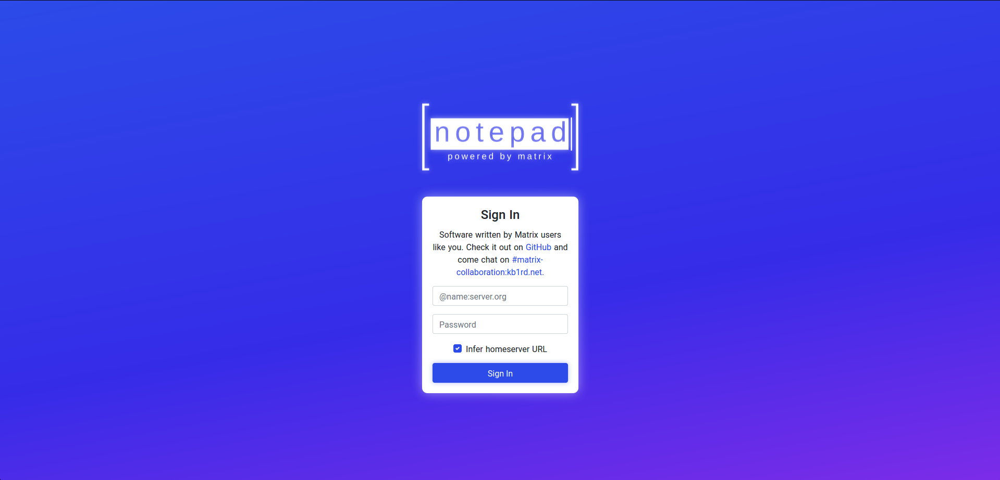
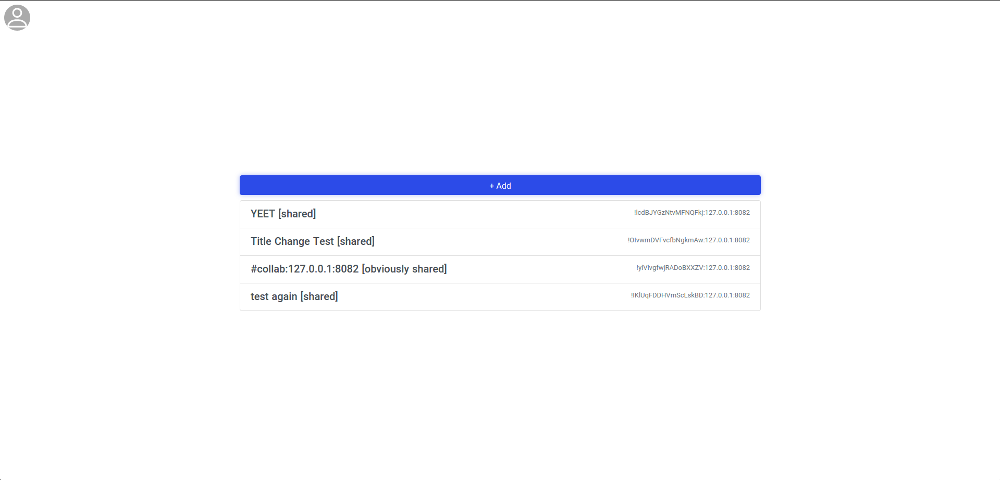
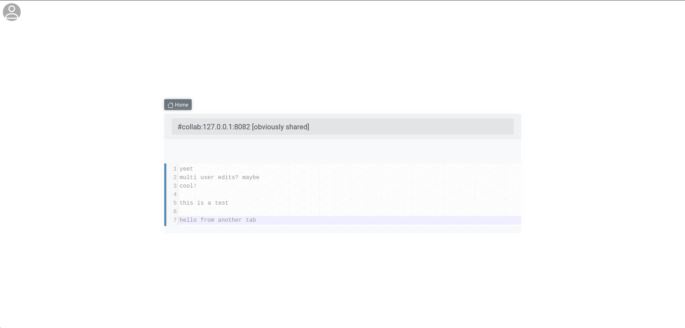

> A buggy way to collaborate on text documents using the [Matrix](https://matrix.org) protocol. When it works, consider this the Matrix Console of collaboration!


Check it out at [matrix-notepad.kb1rd.net](https://matrix-notepad.kb1rd.net/) and come chat at [#matrix-collaboration:kb1rd.net](https://matrix.to/#/#matrix-collaboration:kb1rd.net?via=kb1rd.net&via=matrix.org&via=matrix.geklautecloud.de)! I'd love to hear about what you think (and what issues you encounter)!

## Brief Roadmap
This is not in any particular order:
* [x] More or less working insertions
* [x] More or less working removals
* [ ] Conflict resolution -- Almost!
* [x] Improved UI/UX (this will be incremental)
* [x] Unit testing for the algorithm (`logootish-js` is unit tested)
* [x] Create a different package for the `Logootish` algorithm -- Right [here](https://github.com/KB1RD/logootish-js)
* [ ] Node 'squashing' or similar. Currently Matrix Notepad has to sync ALL of the events :(
* [ ] Rich text editing
* [ ] Create "Matrix Apps" to load `iframe`d apps, such as the Notepad
* [ ] Clean up the code. I've been focusing on the algorithm, so the Notepad had gotten a bit messy

In addition, I think it would be a good idea to discuss future possibilities for sharing more than just text over Matrix and the possibility of creating a unified 'app host' client that manages permissions for applications and allows the user to browse a directory structure.

## Why write this?
Fundementally, it is frustrating that there is no standard way to collaborate on the Internet. There are a bunch of systems to collaborate online, but they require that you trust a single company and, most of the time, have an account with that company. Just as Matrix was founded with the goal of making communication standardized just the way email is, this project was started with the goal of providing a proof-of-concept of how standardized collaboration could work over the Internet and over Matrix.

## Usage
Just head on over to [matrix-notepad.kb1rd.net](https://matrix-notepad.kb1rd.net/) and sign in. This will bring you to a room list. It's not a great idea to re-use rooms, so if you haven't joined a document room yet, click the "Add" button at the top of the room list and either create a room or join an existing one by ID or alias.

### WARNING!
Since this is experimental software, do not use it to store very important or confidential information. I am not responsible for lost information

### Bug Reporting
If you see error messages pop up or you encounter any bugs, **please** report it either on GitHub or on the Matrix chat. This is **very** helpful as I'm sure there are bugs that I don't know about.

## Screenshots




## Contributing
Have a look at the [Wiki](https://github.com/KB1RD/matrix-notepad/wiki) if you're interested in contributing. I'd love the help! The wiki also contains documentation about how the algorithm, `logootish-js`, works internally as well as links to the JSDoc.

## Organization
Here is the directory structure
* `components` -- Vue components
* `layouts` -- Nuxt layouts. This is currently just the default layout
* `pages` -- Nuxt pages
* `plugins` -- Nuxt plugins that perform vital functions for the program that are not the algorithm or the Vuex store
  * `/matrix.js` -- Provides the interface between Matrix, the GUI, and the algorithm. It is dense and poorly written since I'm still trying to figure out where to put everything.
* `static` -- Static files. Currently only has the site icon
* `store` -- The Vuex store. This is used for UI only since I want the algorithm to be seperate from Vue.JS. Vuex does track the state of the Matrix client, but not the state of document nodes (that's all "traditional" ES6 JS)
* `resources` -- Files used in README.md or the docs
* `test` -- A directory that I have reserved for unit testing. This would help **a lot** if I actually implemented it. *sigh*

## Debugging
I have removed the debug panel as of version `0.2.0` in favor of a console based debug under the window-scope variable `$debug`. Here's the main tricks:

```js
// Provides direct access to the ListDocumentModel
$debug.active_document.ldm

// Disable the initial load
$debug.syncback_settings.initial = false

// Manually fetch events (if initial load is disabled)
$debug.active_document.fetchEvents(1)

// Enable the LDM's internal operation log (currently disabled)
// This is helpful for diagnosing a bug that is identified in production
$debug.active_document.setupLogging()

// Dump the LDM's internal operation log (if enabled)
$debug.active_document.printEventLogJSON()
```

## Build Setup
``` bash
# install dependencies
$ yarn install

# serve with hot reload at localhost:3000 (for development)
$ yarn run dev

# generate static site
$ yarn run generate

# get webpack bundle statistics
$ yarn run stats
```

Also, if you want to debug the core algorithm, `logootish-js`, see https://github.com/KB1RD/logootish-js .
I used to include a code sample in here to use `yarn link` to use a local
version of the algorithm, but `yarn link` appears buggy and it's way faster to
test and develop the algorithm on its own. I would encourage potential
developers to use that method instead.